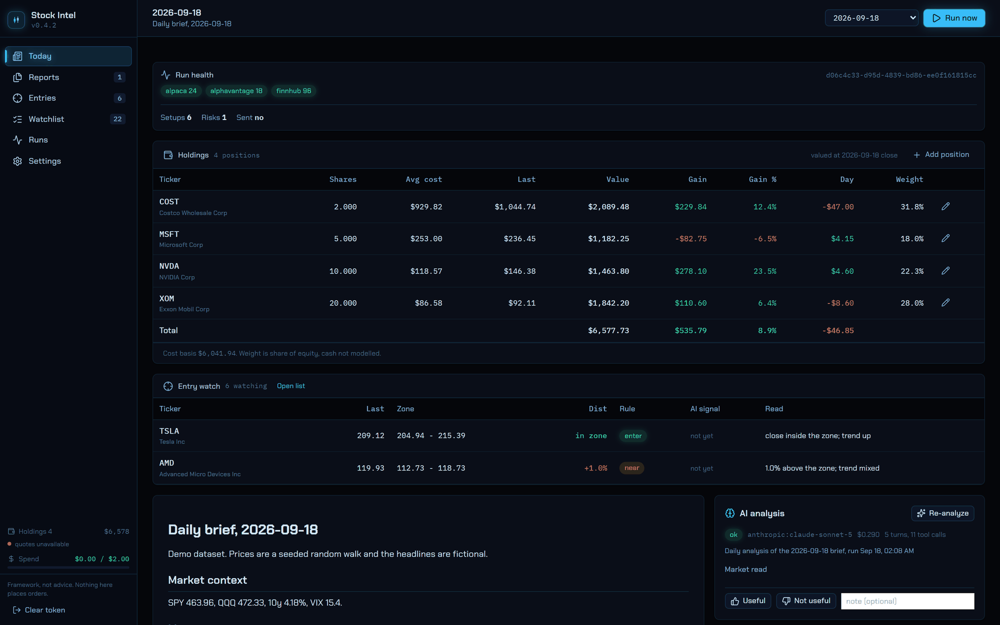
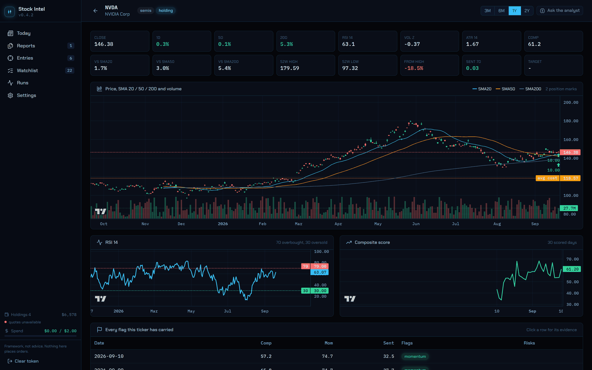
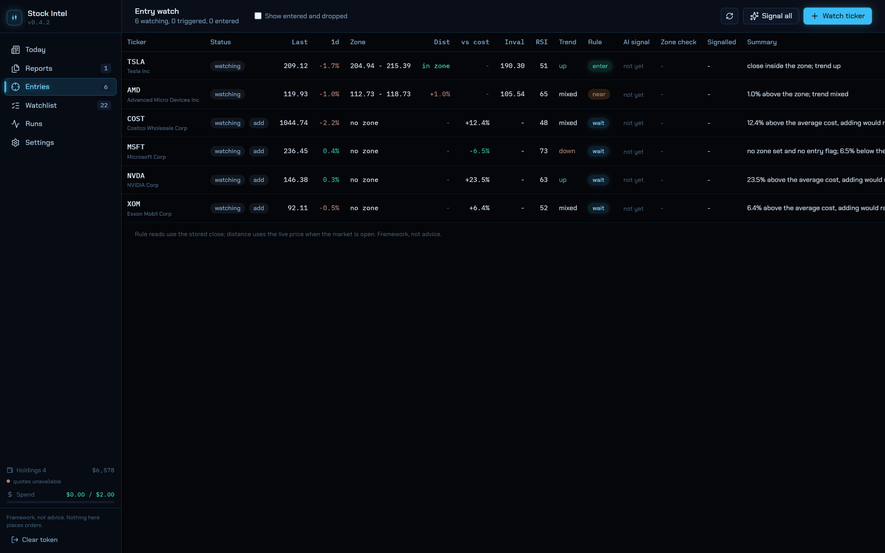
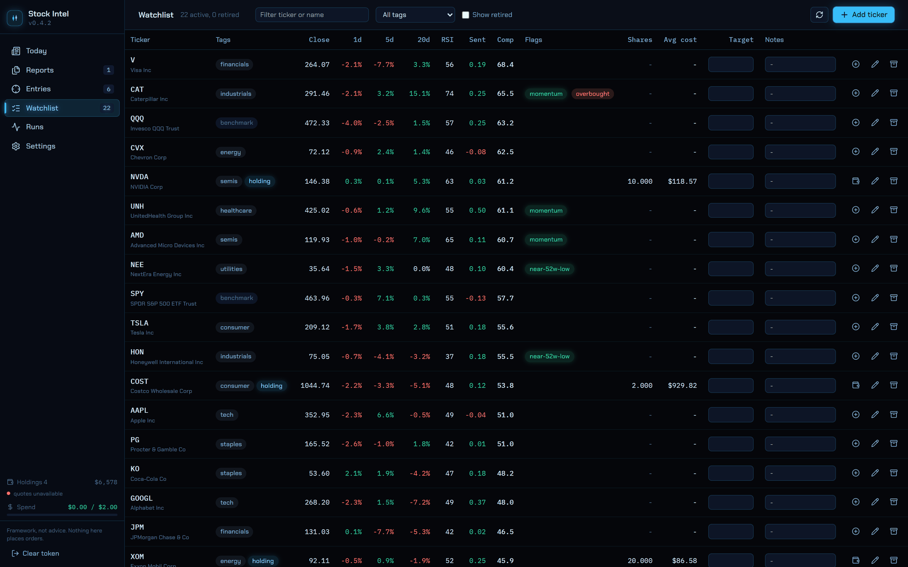
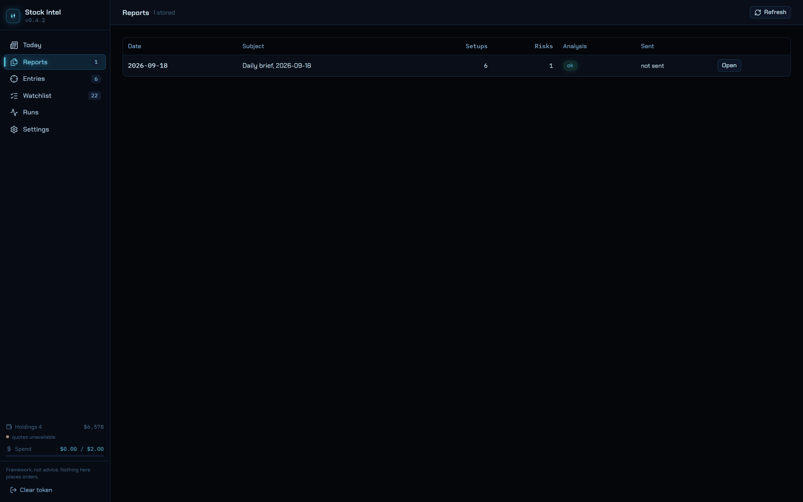
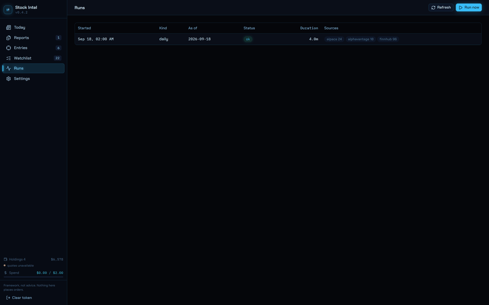
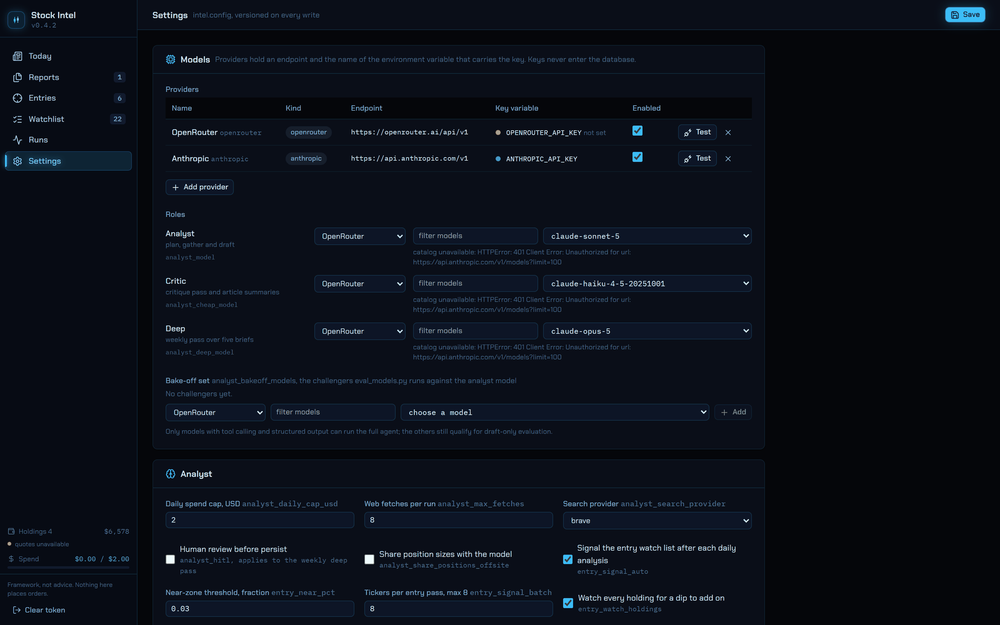
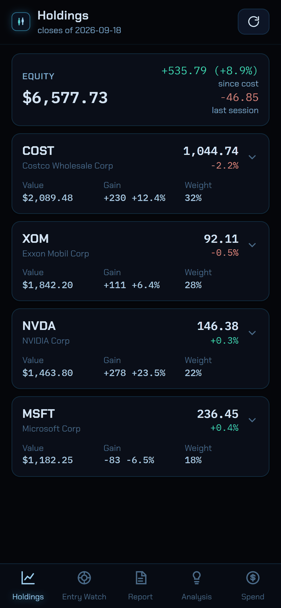

# The screens

Every shot here runs on a demo dataset: the prices are a seeded random walk, the headlines are
fictional and attributed to a wire that does not exist, and the positions are round numbers. No
figure on this page is a real quote or anyone's real holding.

Nothing in the app places an order. See [DISCLAIMER.md](../DISCLAIMER.md).

## Today

The morning brief, and the only screen you have to read. Run health across the top, then holdings,
then the entry-watch rows that are at or near their zone, then the brief itself with the analyst's
read beside it.

## Ticker

One name in full: candles with SMA 20 / 50 / 200 and volume, RSI, the composite score over time,
your position marks and average cost drawn on the price, and every flag the ticker has carried.

## Entries

The entry-watch list. Each row carries a zone, an invalidation, the rule read and, once a pass has
run, the analyst's signal. Rows tagged `add` are holdings, where the zone is capped below your
average cost so adding can only lower it.

## Watchlist

Add, retire, tag and set a target entry. Adding a ticker validates it against Finnhub and kicks off
a two-year price backfill. The `holding` tag is derived from your positions and cannot be set here.

## Reports

Every brief that has been written, newest first.

## Runs

Every pipeline execution: what it collected, which quotas it spent, how long it took and what
degraded. A run that could not fetch something stays green with the failure named rather than
failing silently.

## Settings

Scoring weights, quota budgets, the model provider registry, analyst limits and delivery. Keys are
never stored here: a provider names the environment variable it reads, and the screen only shows
whether that variable is set.

## On a phone

`/m` is the same data in a phone layout: holdings, entry watch, the brief, the analysis and today's
spend against the cap. Read-only except for rating an analysis.

| Holdings | Entry watch | Brief |
|---|---|---|
|  |  |  |
